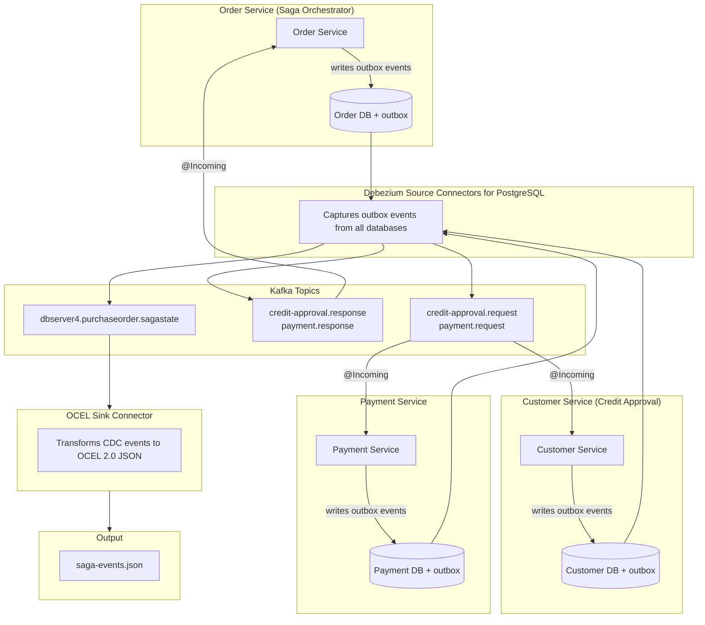
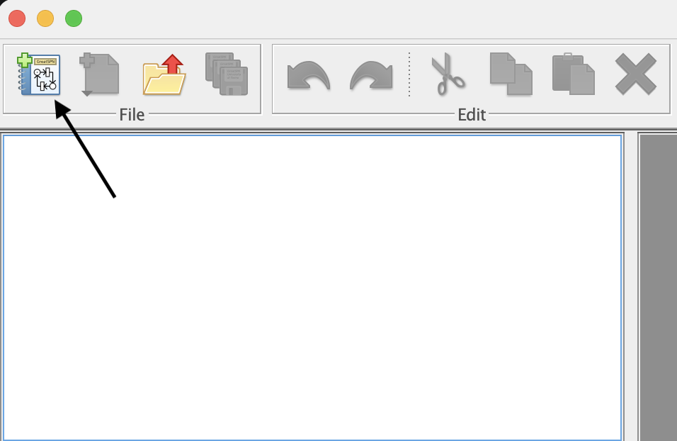
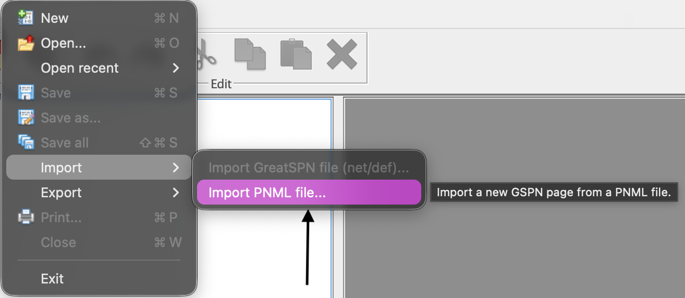
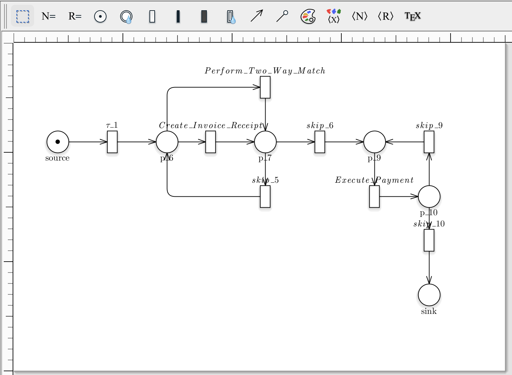
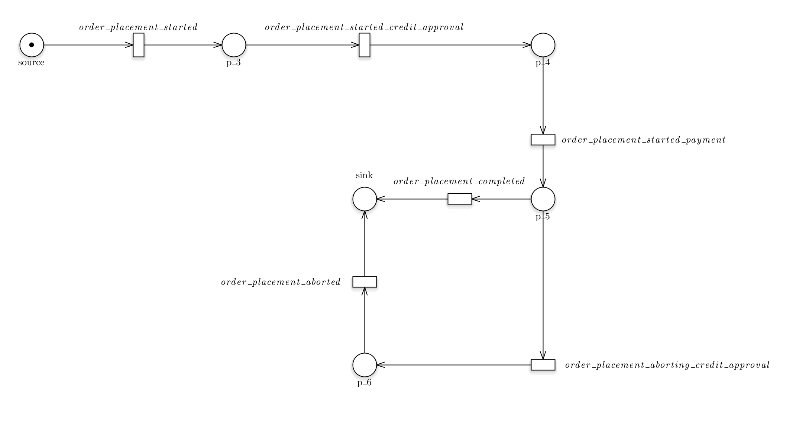
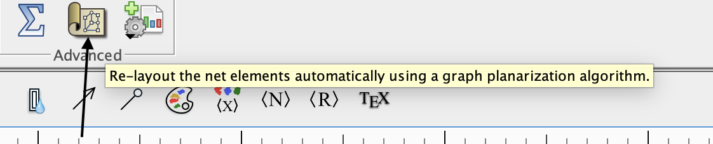
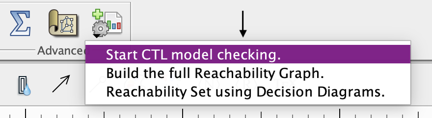
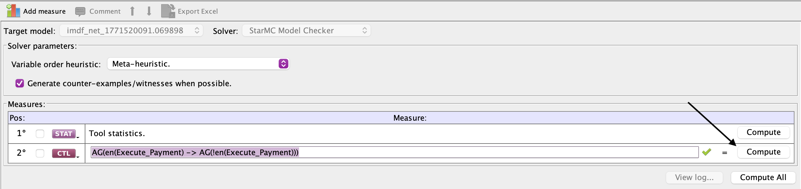
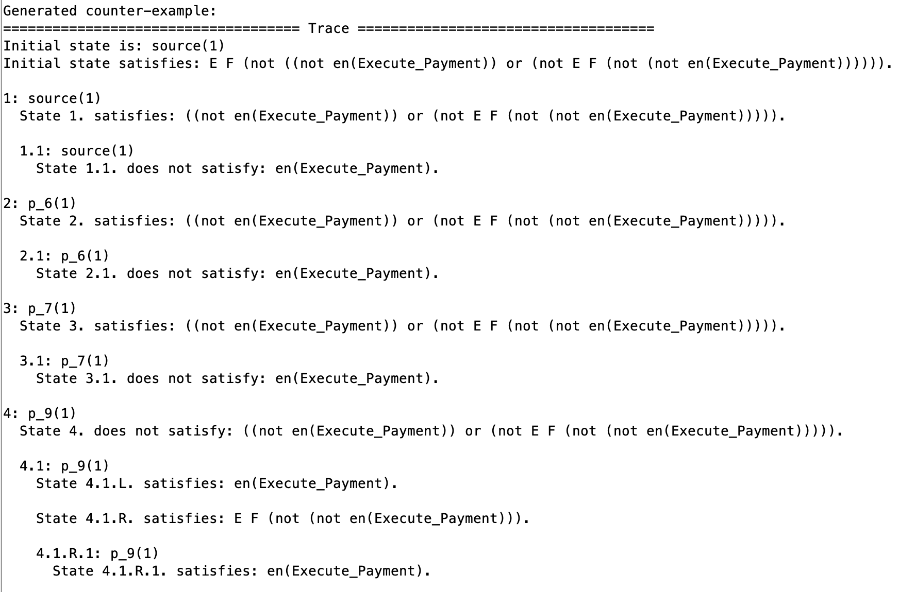
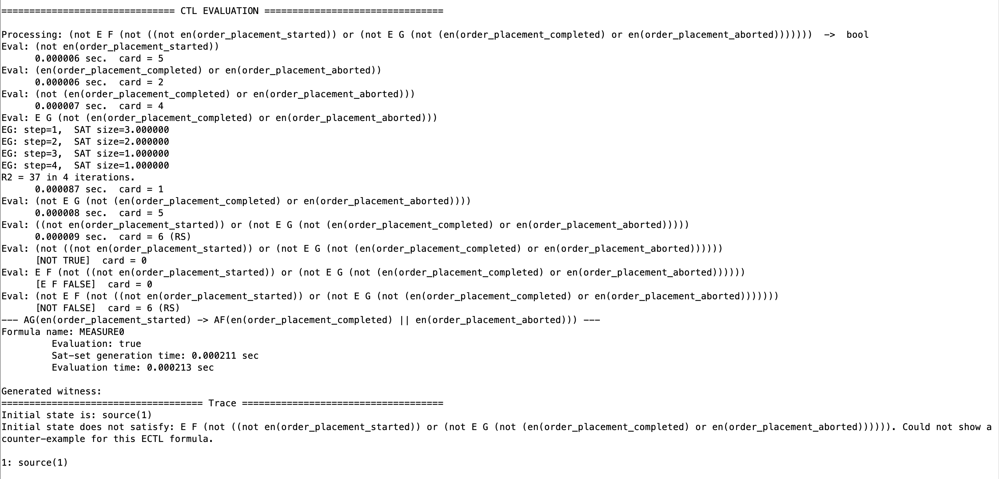

# Formal Verification of Distributed Data-Intensive Application using Petri Nets

## Prerequisites

- Docker and Docker Compose
- Maven 3.x and Java 17+ (only for Option 2 - to build Debezium saga microservices)
- curl and jq (only for Option 2)

## Getting Started

```bash
git clone https://github.com/prophet1906/ddia_analyzer.git
cd ddia_analyzer
git submodule update --init --recursive
```

The `debezium-examples` submodule contains multiple CDC examples. For this demo, we only need the saga example. Use sparse checkout to download only the required files:

```bash
cd debezium-examples
git sparse-checkout init --cone
git sparse-checkout set saga
cd ..
```

---

## Step 1: Obtain OCEL 2.0 Logs

Choose one of the following options to obtain OCEL 2.0 JSON logs:

### Option 1: Download Simulated Datasets from Zenodo

Download existing simulated OCEL2 JSON files from:

- P2P - https://zenodo.org/records/8412920
- Container Logistics - https://zenodo.org/records/18373888
- Order Management - https://zenodo.org/records/18373906

Place the downloaded files in the `./data` directory.

**Note:** For your convenience, we have already included 3 OCEL JSON files in the `./data` folder.

### Option 2: Generate Logs using Saga Example with Debezium

Run the saga example with Debezium source connector and our OCEL sink connector to capture CDC events and export them to OCEL 2.0 JSON format.

#### Saga Example Overview

The Debezium SAGA example implements a distributed saga pattern for order processing. The Order Service acts as the saga orchestrator, coordinating with Customer Service (credit approval) and Payment Service.

**Message Flow:**
- **Producing**: Services write to outbox tables in their databases → Debezium captures and publishes to Kafka
- **Consuming**: Services consume messages directly from Kafka using `@Incoming` annotations



**Saga Flows:**

The OCEL connector captures three distinct saga flows:

| Flow | Trigger | Event Sequence |
|------|---------|----------------|
| **Success** | Valid credit card, amount within limit | started → credit-approval → payment → completed |
| **Payment Failure** | Credit card ending in `9999` | started → credit-approval → payment (failed) → aborting → aborted |
| **Credit Rejection** | Amount > $500 (exceeds credit limit) | started → credit-approval (failed) → aborted |

#### Build the OCEL Connector JARs

The pre-built JAR files (connector + dependencies) are already available in `ocel_connector/jars/`. You can use them directly or build them yourself using:

```bash
docker build -f ocel_connector/Dockerfile --output ocel_connector/jars ocel_connector/
```

#### Run the Saga Example

The Debezium SAGA example implements a distributed saga pattern for order processing with three microservices (Order, Payment, Customer) each with their own PostgreSQL database.

**1. Set Up the Debezium SAGA Example**

```bash
cd debezium-examples/saga

# Set Debezium version
export DEBEZIUM_VERSION=2.1

# Build the services
mvn clean verify -DskipTests

# Start all containers
docker compose up -d --build

# Wait for services to start (about 30-60 seconds)
docker compose ps
```

**2. Deploy the OCEL Connector Plugin**

```bash
# Go back to the project root
cd ../../

# Create plugin directory in the container
docker exec saga-connect-1 mkdir -p /tmp/connect-plugins/ocel-connector

# Copy all JARs (connector + dependencies)
docker cp ocel_connector/jars/. saga-connect-1:/tmp/connect-plugins/ocel-connector/

# Restart Kafka Connect to load the plugin
cd debezium-examples/saga
docker compose restart connect
sleep 30
```

**3. Register All Connectors**

The saga example requires multiple source connectors to capture CDC events from each microservice database, plus the OCEL sink connector to transform events to OCEL 2.0 format.

Run the registration script from the project root:

```bash
cd ../..  # Go back to project root
./scripts/register-connectors.sh
```

This script registers the following connectors:

| Connector | Type | Description |
|-----------|------|-------------|
| `order-outbox-connector` | Source | Captures outbox events from Order Service (saga requests) |
| `payment-outbox-connector` | Source | Captures outbox events from Payment Service (payment responses) |
| `credit-outbox-connector` | Source | Captures outbox events from Customer Service (credit responses) |
| `sagastate-connector` | Source | Captures saga state machine transitions |
| `ocel-saga-sink` | Sink | Transforms saga state events to OCEL 2.0 JSON |

Verify all connectors are running:

```bash
curl -s http://localhost:8083/connectors | jq .
```

**4. Generate Saga Events**

```bash
# Generate test orders (success, payment failure, credit rejection scenarios)
./scripts/generate-test-data.sh -n 30 -d 200

# Or place orders manually:
# SUCCESS: Valid order
curl -X POST http://localhost:8080/orders \
  -H "Content-Type: application/json" \
  -d '{"customerId": 456, "productId": 1, "quantity": 2, "totalPrice": 5000, "creditCardNo": "4532-1234-5678-1234"}'

# PAYMENT FAILURE: Credit card ending in 9999
curl -X POST http://localhost:8080/orders \
  -H "Content-Type: application/json" \
  -d '{"customerId": 456, "productId": 2, "quantity": 1, "totalPrice": 3000, "creditCardNo": "4532-1234-5678-9999"}'

# CREDIT REJECTION: Amount > 50000 cents ($500)
curl -X POST http://localhost:8080/orders \
  -H "Content-Type: application/json" \
  -d '{"customerId": 456, "productId": 3, "quantity": 1, "totalPrice": 60000, "creditCardNo": "4532-1234-5678-1234"}'
```

**5. Extract the OCEL Output**

```bash
# Wait for events to flow through
sleep 15

# Copy output to local data directory
docker cp saga-connect-1:/tmp/ocel-output/saga-events.json data/saga-events.json
```

**6. Validate the OCEL Output**

```bash
./scripts/validate-ocel.sh data/saga-events.json
```

This script validates that the generated file conforms to OCEL 2.0 structure and displays a summary of event types, object types, events, and objects.


---

## Step 2: Mine Petri Nets from OCEL Logs

The miner module processes OCEL2 (Object-Centric Event Log) files and discovers Object-Centric Petri Nets using pm4py.

### Build the Miner Docker Image

```bash
docker build -t miner:latest -f miner/Dockerfile miner/
```

### Command Line Arguments

| Argument | Required | Description |
|----------|----------|-------------|
| `input_file` | Yes | Path to the OCEL2 JSON or XML file |
| `-n, --name` | No | Scenario name for output files (defaults to input filename) |

### Run the Miner

Place your OCEL files in the `./data` directory, then run:

**For Option 1 (P2P dataset from Zenodo):**

```bash
docker run -v $(pwd)/data:/app/data:ro \
           -v $(pwd)/generated_pnml:/app/generated_pnml \
           -v $(pwd)/generated_ocpn:/app/generated_ocpn \
           -v $(pwd)/generated_uncolored_pn:/app/generated_uncolored_pn \
           miner:latest /app/data/ocel2-p2p.json -n procure-to-pay
```

**For Option 2 (Saga events from Debezium):**

```bash
docker run -v $(pwd)/data:/app/data:ro \
           -v $(pwd)/generated_pnml:/app/generated_pnml \
           -v $(pwd)/generated_ocpn:/app/generated_ocpn \
           -v $(pwd)/generated_uncolored_pn:/app/generated_uncolored_pn \
           miner:latest /app/data/saga-events.json -n saga
```

### Output

The miner generates the following outputs in the mounted directories:

| Directory | Description |
|-----------|-------------|
| `generated_pnml/` | PNML files for each object type (e.g., `procure-to-pay_purchase_order.pnml`) |
| `generated_ocpn/` | Object-Centric Petri Net visualization as PNG (e.g., `procure-to-pay.png`) |
| `generated_uncolored_pn/` | Uncolored Petri Net visualizations per object type as PNG (e.g., `procure-to-pay-purchase_order.png`) |

Analysis results and metrics are printed to the console (stdout).

### Metrics Computed

For each object type in the OCEL, the following metrics are computed and displayed:

- **Fitness** (token-based replay and alignments) - measures how well the model can replay the event log
- **Generalization** - measures how well the model generalizes beyond the observed behavior
- **Simplicity** - measures the structural simplicity of the Petri net
- **WF-net soundness analysis** (via WOFLAN) - checks if the Petri net is a sound workflow net

---

## Step 3: Import PNML into GreatSPN and Perform Model Checking

GreatSPN is used for Petri net analysis and verification.

### Installation

Follow the installation instructions at: https://github.com/greatspn/SOURCES/blob/master/docs/INSTALL.md

GreatSPN projects with imported PNML files are already present in the `greatspn/` folder, including the P2P invoice receipt example and the saga example. You can open them directly from GreatSPN.

### Project Setup

Create a new GreatSPN project by clicking the "New Project" button in the toolbar.



### Importing PNML

Import the generated PNML files from the miner output. Go to **File > Import > Import PNML file...** to load the Petri net.

To follow along with the running example from the paper, import `generated_pnml/procure-to-pay_invoice receipt.pnml`.



After importing, the Petri net will be displayed in the editor with places (circles), transitions (rectangles), and arcs showing the process flow.



For the saga example, the imported Petri net will look similar to this:



### Re-layout the Net

After importing, use the re-layout function to automatically arrange the net elements using a graph planarization algorithm. Click the layout button in the **Advanced** toolbar.



### CTL Model Checking

To perform formal verification, start the CTL model checker from the toolbar dropdown menu. Select **Start CTL model checking**.



Configure your CTL formulas in the Measures panel and click **Compute** to verify the property.

**Example CTL formulas:**

- **P2P Petri net**: To verify that once "Execute_Payment" is enabled it will never be enabled again (i.e., it can only execute once), use:
  ```
  AG(en(Execute_Payment) -> AG(!en(Execute_Payment)))
  ```

- **Saga Petri net**: To verify that an order for which placement started eventually ends either in completed or aborted, use:
  ```
  AG(en(order_placement_started) -> AF(en(order_placement_completed) || en(order_placement_aborted)))
  ```



### Counter-example

When a CTL property is violated, GreatSPN generates a counter-example trace showing the sequence of states that violates the property. If the property is satisfied, no trace is found.

**Property violated** - counter-example trace found:



**Property satisfied** - no trace found:



---

## Troubleshooting (Option 2)

### Connector Task Failed

Check the task trace:

```bash
curl -s http://localhost:8083/connectors/<connector-name>/status | jq '.tasks[0].trace'
```

Common issues:
- **TracingInterceptor not found**: Add `producer.override.interceptor.classes: ""` or `consumer.override.interceptor.classes: ""`
- **Database connection failed**: Verify database hostname and credentials
- **Topic not found**: Ensure source connector is running and producing data

### No OCEL Output

1. Check if the sink connector is running:
   ```bash
   curl -s http://localhost:8083/connectors/ocel-saga-sink/status | jq .
   ```

2. Check if data is on the topics:
   ```bash
   docker exec saga-kafka-1 /kafka/bin/kafka-console-consumer.sh \
     --bootstrap-server kafka:9092 \
     --topic dbserver4.purchaseorder.sagastate \
     --from-beginning \
     --max-messages 1
   ```

3. Check connector logs for errors:
   ```bash
   docker logs saga-connect-1 2>&1 | grep -i ocel
   ```

4. Trigger a flush by placing another order:
   ```bash
   curl -X POST http://localhost:8080/orders \
     -H "Content-Type: application/json" \
     -d '{"customerId": 456, "productId": 1, "quantity": 1, "totalPrice": 100, "creditCardNo": "1234-5678-9012-3456"}'
   ```

### Plugin Not Loaded

After deploying JARs, restart Kafka Connect:

```bash
cd debezium-examples/saga
docker compose restart connect
sleep 30
```

Verify the plugin is loaded:

```bash
curl -s http://localhost:8083/connector-plugins | jq '.[] | select(.class | contains("Ocel"))'
```

### Empty OCEL Output

The OCEL file is written on Kafka Connect flush (offset commit). If you see empty output:
1. Wait longer for events to accumulate
2. Place additional orders to trigger more flushes
3. Check that records are being processed: `docker logs saga-connect-1 2>&1 | grep "Processing record"`

---

## Monitoring Commands (Option 2)

### List All Connectors

```bash
curl -s http://localhost:8083/connectors | jq .
```

### Check Connector Status

```bash
# Source connectors
curl -s http://localhost:8083/connectors/order-outbox-connector/status | jq .
curl -s http://localhost:8083/connectors/payment-outbox-connector/status | jq .
curl -s http://localhost:8083/connectors/credit-outbox-connector/status | jq .
curl -s http://localhost:8083/connectors/sagastate-connector/status | jq .

# Sink connector
curl -s http://localhost:8083/connectors/ocel-saga-sink/status | jq .
```

### View Kafka Topics

```bash
docker exec saga-kafka-1 /kafka/bin/kafka-topics.sh \
  --bootstrap-server kafka:9092 \
  --list
```

### Consume Raw CDC Events

```bash
# View saga state events
docker exec saga-kafka-1 /kafka/bin/kafka-console-consumer.sh \
  --bootstrap-server kafka:9092 \
  --topic dbserver4.purchaseorder.sagastate \
  --from-beginning \
  --max-messages 5

# View purchase order events
docker exec saga-kafka-1 /kafka/bin/kafka-console-consumer.sh \
  --bootstrap-server kafka:9092 \
  --topic order.purchaseorder.purchaseorder \
  --from-beginning \
  --max-messages 5
```

### View Kafka Connect Logs

```bash
docker logs saga-connect-1 --tail 100 -f
```

---

## Clean Up (Option 2)

```bash
# Delete all connectors
curl -X DELETE http://localhost:8083/connectors/ocel-saga-sink
curl -X DELETE http://localhost:8083/connectors/sagastate-connector
curl -X DELETE http://localhost:8083/connectors/order-outbox-connector
curl -X DELETE http://localhost:8083/connectors/payment-outbox-connector
curl -X DELETE http://localhost:8083/connectors/credit-outbox-connector

# Stop all containers
cd debezium-examples/saga
docker compose down

# Remove volumes (optional - resets all data)
docker compose down -v
```

---

## References

- [OCEL 2.0 Standard](https://www.ocel-standard.org/)
- [Debezium Documentation](https://debezium.io/documentation/)
- [Kafka Connect Documentation](https://kafka.apache.org/documentation/#connect)
- [Debezium SAGA Example](https://github.com/debezium/debezium-examples/tree/main/saga)
- [GreatSPN](https://github.com/greatspn/SOURCES)
